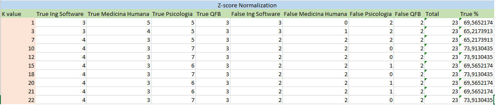

# UAZ Students

## 1st Section
### -----------------------------

### The dataset
###### This dataset contains relevant data of the students who are studying the undergraduate level of different programs at the Autonomous University of Zacatecas.
###### The data were obtained through surveys that were made to the student population, later we selected those that could help us in our investigation.
###### The data set file's name is datasetUAZ.csv, in the next block we read the dataset to continue working with it.

```{r}
knitr::opts_chunk$set(echo = TRUE)

dsuaz <- read.csv("datasetUAZ.csv", stringsAsFactors = FALSE)
```


#### The Survey
###### The survey consisted of 23 questions, which became our attributes in the dataset, The survey was carried out digitally, we created the survey with the tool of Google, and through social networks we distributed it among the students.
###### After completing the survey we obtained 254 responses in total, however after analyzing the data we realized that only 142 records were useful, since we grouped the data according to the degree to which they belonged we observed that the numbers of students of The same degree that answered our survey was very different, so to have more balanced data regarding the number of students who answered the survey we decided to eliminate those answers that were below average.
###### The main limitation we found when trying to conduct the survey was the time we had and the amount of answers we were supposed to have, for that reason we decided to do it digitally with the help of social networks.
###### Due to this we had the disadvantage that the students answered very attached to their feelings and not in an objective way, due to this our data needed of format and cleaning that we had to realize by hand.
###### Then we can observe each one of the questions we made and some examples of the types of answers that we obtained:
```{r strwbcd}
str(dsuaz)
```

##### Head & Tail
###### With the head and tail functions we can get a small sample of the data, those first six records with each of its attributes and their values and the last six records of the dataset.
```{r, headtail}
head(dsuaz)
tail(dsuaz)
```

##### Dataset Summary
###### With the summary function we obtain different statistics of the data stored in the dataset. This function invokes different methods according to the type of object that is. Receiving as argument, in this specific case is a dataset.
###### We can observe the values: minimum, maximum, mean, median and quartiles of each of the variables that make up the dataset.
```{r, summary}
summary(dsuaz)
```

#### Variables Description

##### Gender
###### The interview was conducted to students of the UAZ, of which 51 were men and 62 women.
```{r, genero}
table(dsuaz$genero)
```

##### Age
###### The ages of the students interviewed range from 18 to 28 years. In the next block we can observe the number of students interviewed for each of the ages obtained with the survey.
###### But we can also observe other data with the summary function, note that the first quartile is in 19 years and the third in 22 years, which indicates that the greater number of students is between these ages, in fact the Median is 21 years, if we go back a little, we can see that actually 21 years has the largest number of students same that 22 years.
```{r, edad}
table(dsuaz$edad)
summary(dsuaz$edad)
```

#####Town
###### In the next block we can see from which city the students interviewed come from.
```{r, municipio}
table(dsuaz$municipio)
```

##### Study Hours per day
######We asked the interviewed students how many hours they spend studying outside the university, most spend between 4 and 6 hours studying a day.
```{r, hrsestudio}
table(dsuaz$hrs_estudio_dia)
summary(dsuaz$hrs_estudio_dia)
```

##### Tv hours per day
###### More than half of the total number of students interviewed responded by not spending any time watching TV per day. However we still have 39 students watch 4 hours of TV per day and a student who watches TV 6 hours per day.
```{r, hrstv}
table(dsuaz$hrs_tv_dia)
summary(dsuaz$hrs_tv_dia)
```

##### Exercise hours per day
###### Most students do not do any type of exercise a day, only 39 students are those who perform 2 to 4 hours of exercise per day.
```{r, hrsejercicio}
table(dsuaz$hrs_ejercicio_dia)
summary(dsuaz$hrs_ejercicio_dia)
```

##### Hours of social activity per day
###### Almost all students interviewed said they have time for social activities per day, most students spend between 1 and 3 hours a day to interact with other people.
```{r, hrsatcvsocial}
table(dsuaz$hrs_actsocial_dia)
summary(dsuaz$hrs_actsocial_dia)
```

##### Hours students spend in college
###### Students spend from 0 to 8 hours in college. The median is 7, and the first and third quartiles are between 6 and 7, so that most of the students, 91 to be exact, spend from 6 to 7 hours receiving classes in classrooms.
```{r, hrsuniversidad}
table(dsuaz$hrs_universidad_dia)
summary(dsuaz$hrs_universidad_dia)
```

##### Hours of sleep per day
###### In the next block we can see that most students sleep between 6 and 8 hours a day, few students sleep less than 6 hours per day and are even fewer those who sleep more than 10 hours .
###### Given the number of hours recommended for anyone to sleep, we have obtained good answers from the students.
```{r, hrsdormir}
table(dsuaz$hrs_dormir_dia)
summary(dsuaz$hrs_dormir_dia)
```

##### Use of public transportation between students
###### We used the values 0 for answer no, and 1 for yes. So, most of the students use the public transportation, just 22 students dont use it.
```{r, usotransporte}
table(dsuaz$transporte_publico)
summary(dsuaz$transporte_publico)
```

##### Use of cafeteria between students
###### We used the values 0 for answer no, and 1 for yes. In this case the results are pretty balanced, only 50 percent plus one, that is, 57 of the students do not use the college canteen and 56 of the students interviewed do so.

```{r, comedor}
table(dsuaz$comedor)
summary(dsuaz$comedor)
```

##### Students who have a scholarship
###### We used the values 0 for answer no, and 1 for yes. 
###### We asked to the students if they had some type of scholarship, without specifying what type, simply if they had one or not. 87 percent of the students interviewed responded that they did not have any type of scholarship, the rest, 36 students from the total of those interviewed said they had a scholarship.
```{r, becario}
table(dsuaz$becario)
summary(dsuaz$becario)
```

##### Students per career
###### The interview was released to UAZ students, but as mentioned earlier we eliminated the answers from those who did not have enough results to study.
###### Therefore our study has been done with the students of the following four careers:
###### ---> Software Engineering
###### ---> Medicine
###### ---> Psychology
###### ---> Pharmaceutical Chemist Biologist
###### In the next block we can find the amount of students in each career.
```{r, licenciatura}
table(dsuaz$licenciatura)
```

##### Semester students
###### We interview students from each semester of the different careers, the semesters of which we have the most results are the second, eighth and tenth semester. The first and third quartiles tell us where the greatest number of students are, between the second and eighth semester.
```{r, semestre}
table(dsuaz$semestre)
summary(dsuaz$semestre)
```

##### Difficulty perceived by students of their career
###### Students also asked about the difficulty with which they perceived their studies in each career, values are:
###### ---> 1: Easy
###### ---> 2: Regular
###### ---> 3: Difficult
###### ---> 4: Very Difficult
###### Looking at the results of the summary we realize that almost all students think that their career is regular or difficult, there were students who thought it was easy or very difficult, but one hundred students were the opinion among the first and third quartile, regular or difficult.
```{r, dificultad}
table(dsuaz$dificultad_licenciatura)
summary(dsuaz$dificultad_licenciatura)
```

##### Passion of students for their career 
###### Another important part that we wanted to find out was the passion that every student has for his career, we gave them a scale of 1 to 10, in which 1 was nothing at all to 10, very passionate.
###### The results were as follows, the lowest values we obtained were four, although the majority remained between 8 and 10, which indicates that although they are not the total of the students, much of them is in the place that he is passionate about.
```{r, pasion}
table(dsuaz$pasion_licenciatura)
summary(dsuaz$pasion_licenciatura)
```

##### Amount subjects failed by students
###### The above factors can lead to a good execution of our school activities or the opposite. Such is the case of those students who end up repeating subjects.
###### So we asked them how many subjects they had repeated so far in your career. The results were as follows, 92 students out of 113 who are the total, said they did not repeat any subject, 10 students have repeated one subject and the rest have repeated 2 to 5 subjects.
```{r, materiasrepetidas}
table(dsuaz$materias_repetidas)
summary(dsuaz$materias_repetidas)
```

##### Academic average of the students
###### One way to know a student's performance is their academic average, and although it is not the only or best way to do it, our grade point average ends up being a letter of introduction in a school environment.
###### So we decided to ask the students what their current grade point average is.
###### These range from 7 to 9.8. Our first and third quartiles are between 8.0 and 8.98, which indicates that the majority of students are in the same grade range, 21 students said to have an academic average of 8.0, second with 11 students is 8.5 and third with 10 students 9.0.
```{r, promedio}
table(dsuaz$promedio)
summary(dsuaz$promedio)
```

##### Expectation of job offer
###### Another important factor to take into account about the career we choose is the expectation of work that we have when graduating. We asked the students about their job offer expectation, we obtained the following results.
###### The range of answers is from 0 to 10. 0 no expectation of job offer upon graduation and 10 much expectation, our results spread throughout the scale.
###### The first quartile is in 5 and the third in 9, 20 students rated their job offer expectation with 5, another group of 20 students put 8 and another 20 qualified with 10.
###### Taking as acceptable from 8 to 10, only 58 students, that is, only 65 percent of the students have a good expectation of the job offer when they graduate, the remaining 35 percent think not it will be easy to get a job upon graduation.
```{r, ofertalaboral}
table(dsuaz$oferta_laboral)
summary(dsuaz$oferta_laboral)
```

##### Expectation of monthly salary upon graduation
###### In addition to the job offer, it is important to know the estimated salary we will have upon graduation, so we ask the students what their monthly salary expectations are when they enter the labor market.
###### The results are the following:
```{r, salario}
table(dsuaz$Ssalario_estimado)
```

##### Plans of students upon graduation
###### In addition to the previous questions we wanted to know what the students want to do when they graduate, whether they work or study a postgraduate course, the results were:
```{r, planesegreso}
table(dsuaz$planes_egreso)
```

### Box plots
###### A box plot is a graphical rendition of statistical data based on the minimum, first quartile, median, third quartile, and maximum. The term "box plot" comes from the fact that the graph looks like a rectangle with lines extending from the top and bottom. 
<center>


#### Grade point average
###### In the following box plot we can observe the grade point average of the students, the minus 7.0, the greater 9.8.
###### The median is 8.4, which we can observe in the highlighted line, the greater number of students is between 8.0 and 8.9.
```{r}
boxplot(dsuaz$promedio, main="GPA of each student", col='#2999AD', ylab="Grade")
```

#### Passion of students for their career 
###### Here we observe the passion that the students have for their career.
###### Most students rated their passion for their career between 8 and 10, the median is 9.
###### We have an outlier, that is, isolated data of 4, which means that although there are few concurrences with this data, we have students who answered 4.
```{r}
boxplot(dsuaz$pasion_licenciatura, main  = "Passion of students for their career", col = "#FFC700", ylab = "Passion")
```
#### Job offer expectation
###### Here the results range from 0 to 10, across the whole scale.
###### The median is 8, and the first and third quartiles are between 5 and 9, which indicates that the majority of students qualify their expectation of labor supply among this range.
```{r}
boxplot(dsuaz$oferta_laboral, main="Job offer expectation", col="#A30F2E", ylab="Expectation")
```

#### Students Age
###### Students range from the age of 18 up to 28 years, in the latter case we have an isolated data, so the maximum is marked in 26 years.
###### The median age among respondents is 21 years.
###### Most of the students interviewed are between the ages of 19 and 22 years old.
```{r}
boxplot(dsuaz$edad, main="Students age", col = "#66B21A", ylab="Age")
```

### Gender boxplots
#### Hours of Study according to the gender
###### In the box below we can see the difference in study hours according to the gender of the students.
###### We can observe that the median in both genders is 4 hours of study per day, but in addition there are no minimum, maximum or the other elements of the box plot.
###### This is because almost all students spend 4 hours per day to study, and we only have some isolated cases in both sexes of those who do not study abolutely anything and some others study 6 or 8 hours daily.
```{r, studyhrspergenderboxplot}
boxplot(split(dsuaz$hrs_estudio_dia,dsuaz$genero),las = 2,main=toupper('Hours of Study according to the gender'), font.main=3, cex.main=1.2, ylab="Hours of study", font.lab=3, col='#FFBD59', names = c('Male','Female'))
```

#### Hours of Sleep according to the gender
###### Here we observe the number of hours of sleep depending on the gender of the students, the median in both genders is 8 hours a day.
###### In both genders the minimum daily sleep time is 3 hours, but only a few women responded that they slept more than 8 hours, so the maximum in the women's boxplot is 10.
```{r, hrssleeppergenderboxplot}
boxplot(split(dsuaz$hrs_dormir_dia,dsuaz$genero),las = 2,main=toupper('Hours of Sleep according to the gender'), font.main=3, cex.main=1.2, ylab="Hours of Sleep", font.lab=3, col='#FF2E47', names = c('Male','Female'))
```

#### Hours of Exercise according to the gender
###### This graph shows the number of hours dedicated to physical exercise by gender.
###### In both genders the median and the first quartile are in the same place, 0, which indicates that most students do not spend time exercising daily.
###### However in the graph of the masculine gender we can observe the maximum and the third quartile in 4 as opposed to the graph of the feminine gender that its third quartile is in 2 and the maximum in 4, this means that of Students who do exercise men spend more time than women exercising.
```{r, hrseexercisepergenderboxplot}
boxplot(split(dsuaz$hrs_ejercicio_dia,dsuaz$genero),las = 2,main=toupper('Hours of Exercise according to the gender'), font.main=3, cex.main=1.2, ylab="Hours of Exercise", font.lab=3, col='#8CBA5C', names = c('Male','Female'))
```

#### Hours of Video Games according to the gender
###### In the following graph we can observe the amount of hours that students dedicate to playing video games according to the masculine or feminine gender.
###### On the left side we can see the box plot of the masculine gender, the median is 2, the first and third quartiles are between 0 and 4, which indicates that most male students dedicated between 0 or 4 hours playing video games daily, the maximum is at 6.
###### On the opposite side, there are the results of the female students, who agreed not to spend any time of the day playing video games except some who said they dedicate 4 or 6 hours a day daily.
```{r, hrsvgmspergenderboxplot}
boxplot(split(dsuaz$hrs_vjuegos_dia,dsuaz$genero),las = 2,main=toupper('Hours of Video Games according to the gender'), font.main=3, cex.main=1.2, ylab="Hours of Video Games", font.lab=3, col='#B266A6', names = c('Male','Female'))
```

#### Hours of TV according to the gender
###### Below we can see the number of hours students spend watching TV per day according to their gender.
###### In both genders agreed on the first and third quartiles, which are between 0 and 4, the same as the minimum and the median found at 0, which indicates that a significant proportion of the students do not dedicate Time to watch television, however the majority is between 0 and 4 hours a day.
###### We can also observe that there are men who spend more time than women in front of the TV, since they go from 4 to 6 hours a day from the third quartile to the maximum value.
```{r, hrstvpergenderboxplot}
boxplot(split(dsuaz$hrs_tv_dia,dsuaz$genero),las = 2,main=toupper('Hours of TV according to the gender'), font.main=3, cex.main=1.2, ylab="Hours of TV", font.lab=3, col='#6E6E9C', names = c('Male','Female'))
```

#### Hours of Social Activity according to the gender
###### Below we can see the number of hours dedicated to social activities per day.
###### Here we can see that both genders seem more than one could imagine, since both graphs are almost identical, except for the isolated cases that appear.
###### Both men and women spend between 0 and 6 hours for social activities daily, in both genders the majority of students spend between 1 and 3 hours a day for these activities.
###### We can also observe that in both genders the median is 2 hours.
###### In both cases we can observe some isolated cases, ranging from 8 to 10 hours for social activities per day.
```{r, hrsactvsocialpergenderboxplot}
boxplot(split(dsuaz$hrs_actsocial_dia,dsuaz$genero),las = 2,main=toupper('Hours of Social Activity according to the gender'), font.main=3, cex.main=1.2, ylab="Hours of Activity Social", font.lab=3, col='#26667D', names = c('Male','Female'))
```


### Sleepy hours boxplots
#### Sleep hours for each student
###### Here we observe the number of hours of sleep that the students dedicated daily, the answers were of 3 to 10 hours daily.
###### But most students sleep 6-8 hours per day.
###### The median is 8 hours per day, which is recommended by science.
```{r}
boxplot(dsuaz$hrs_dormir_dia, main="Sleep hours for each student", ylab = "Sleepy hours", col = "#FF2185")
```

#### Hours of sleep according to age
###### In the following graph we can see the number of hours that students sleep depending on the age they have.
###### Most students between the ages of 18, 19, 20, 21, 23 and 24 years old sleep between 6 and 8 hours a day.
###### 22- and 25-year-olds agreed to sleep 8 hours per day, except for some 22-year-olds who reported sleeping 6 or 3 hours per day.
###### On the other hand the students of 26 years said to sleep 10 hrs daily and the students of 28 years 6 hours daily.
```{r, sleephrsperagelboxplot}
boxplot(split(dsuaz$hrs_dormir_dia,dsuaz$edad),main=toupper('Hours of sleep according to age'), font.main=3, cex.main=1.2, xlab="Age", ylab="Hours of sleep", font.lab=3, col="#31B1B1")
```

#### Hours of Sleep according to the career
###### In the following box plots we can observe the number of hours that students sleep depending on the career they attend.
###### The results are divided into two identical patterns.
###### On the one hand we have Software Engineering students and Psychology students who agreed to sleep 8 hours a day, but also present the same isolated cases in which some students responded to sleep 3, 6 or 10 Hours daily.
###### The other pattern we found with the students of Medicine and those of Chemical Pharmaceutical Biologist, who agreed on their minimum and maximum values between 3 and 8 hours of sleep per day.
###### In addition the median of medical students and QFB is 6 hours. And most of the students in these two careers sleep between 6 and 8 hours a day.
```{r, sleephrsperlicenciaturalboxplot}
boxplot(split(dsuaz$hrs_dormir_dia,dsuaz$licenciatura),las = 2,main=toupper('Hours of Sleep according to the career'), font.main=3, cex.main=1.2, ylab="Hours of sleep", font.lab=3, col='#409973', names = c('Software','Medicine','Psychology','QFB'))
```


### Study hours boxplots
#### Study hours each day
###### In the box below we can observe the number of hours students interviewed dedicated to studying during the day.
###### Most students agreed to sleep 8 hours a day, there were only a few isolated cases marked with the outliers, of students who said they slept 0, 6 or 8 hours a day.
```{r, studyhrs}
boxplot(dsuaz$hrs_estudio_dia, xlab="Study hours each day")
```

#### Hours of Study according to age
##### Below we can see the number of hours students study per day, thanks to this graph we can realize that most students study the same number of hours regardless of the age they have.
###### The majority of students aged 18 to 26 study 4 hours per day, only 28-year-old students answered that they were studying 6 hours per day.
###### We might think that the younger the student is less dedicated or spend less time studying, but thanks to this survey we were able to realize that age does not have a strong impact on the amount of hours that the students invest in their preparation outside the classroom.
```{r, studyhrsperagelboxplot}
boxplot(split(dsuaz$hrs_estudio_dia,dsuaz$edad),main=toupper('Hours of Study according to age'), font.main=3, cex.main=1.2, xlab="Age", ylab="Hours of study", font.lab=3, col="#0A8FA3")
```

#### Hours of Study according to the semester
###### In the next block we look at the number of hours that students spend studying outside the classroom depending on the semester they attend.
###### Most students agree to study 4 hours per day after school, nevertheless we have some isolated data from students who do not spend any time to study per day.
###### Something important to note in this graph is that no matter what level they are in during their career, students usually spend the same amount of time in their preparation outside the classroom.
```{r, studyhrspersemesterlboxplot}
boxplot(split(dsuaz$hrs_estudio_dia,dsuaz$semestre),main=toupper('Hours of Study according to the semester'), font.main=3, cex.main=1.2, xlab="Semester", ylab="Hours of study", font.lab=3, col="#1A80B2")
```

#### Hours of Study according to the career
###### This chart shows the number of hours that students spend studying outside the classroom based on the degree they are studying.
###### We can see that Software Engineering, Psychology and QFB have the same result, which means that students in these degrees study 4 hours per day while not in class. As we observed in the graph above, they present outliers of students who study 6 hours a day or who do not dedicate time to study at all.
###### In the case of medicine our median is at the same level as the other careers, 4, but here we have a greater range of answers, since the third quartile is in 6 hours per day and also a maximum value of 8 hours.
###### This means that most medical students invest between 4 and 6 hours per day studying at home, but there are also medical students who study up to 8 hours a day.
```{r, studyhrsperlicenciaturalboxplot}
boxplot(split(dsuaz$hrs_estudio_dia,dsuaz$licenciatura),las = 2,main=toupper('Hours of Study according to the career'), font.main=3, cex.main=1.2, ylab="Hours of study", font.lab=3, col='#FFBD59', names = c('Software','Medicine','Psychology','QFB'))
```
### Career boxplots

#### Hours at university according to the career
###### According to the following graph we can observe that the amount of hours that the students spend in the university receiving classes is somewhat variable depending to the career that they are studying.
###### In Software Engineering most students spend in the classroom between 4 and 7 hours a day, the median is 6 hours. But the minimum value that they answered is 0, to which we assume that they are students who are doing their thesis project and they have already accredited the total of necessary subjects to be titled.
###### In the case of Medicine almost every student responded that they spent 7 hours a day in the university, except for some isolated cases that said to spend only 6 hours.
###### In the psychology course, the students agreed to spend 6 hours studying in the university daily, but there are also isolated cases of those who spend 7 hours.
###### Finally, in the case of QFB students range from 4 hours to 8 hours a day in college. Although the majority spend between 6 and 8 hours a day, the median of QFB students is 7 hours.
```{r, unihrsperlicenciaturalboxplot}
boxplot(split(dsuaz$hrs_universidad_dia,dsuaz$licenciatura),las = 2,main=toupper('Hours at University according to the career'), font.main=3, cex.main=1.2, ylab="Hours at university", font.lab=3, col='#FF8A36', names = c('Software','Medicine','Psychology','QFB'))
```

#### Difficulty appreciated according to the career
###### The graph below shows the level of difficulty students perceive in their careers.
###### The values are as follows:
###### 1 = Easy
###### 2 = Regular
###### 3 = Difficult
###### 4 = Vey Difficult
###### In the case of software engineering, 100 percent of students are in the range of 2 to 3, that is, between regular and difficult, the median is regular.
###### On the other hand, almost every medical student thinks that his career is difficult, except for some students who qualified the difficulty in the other levels.
###### In case of psychology also almost every student responded that his career is regular, although we also have isolated cases that qualify the career as easy or difficult.
###### Finally in QFB, most students think that the course is regular or rifficult, but we also have students who think it is very difficult.
```{r, difficultyperlicenciaturalboxplot}
boxplot(split(dsuaz$dificultad_licenciatura,dsuaz$licenciatura),las = 2,main=toupper('Difficulty appreciated according to the career'), font.main=3, cex.main=1.2, ylab="0 = Min, 4 = Max", font.lab=3, col='#FA668A', names = c('Software','Medicine','Psychology','QFB'))
```

#### Repeated subjects according to the career
###### According to the data we collect, students of Software Engineering are those who tend to repeat at least one subject. In the other careers, almost every student responded that they did not repeat any subject yet.
###### However, in the four careers studied we find some isolated cases of students who have repeated one or more subjects.
###### Just as in Software Engineering is the largest number of students with repeated subjects, the career with fewer students with repeated subjects is Psychology.
```{r, repeatedperlicenciaturalboxplot}
boxplot(split(dsuaz$materias_repetidas,dsuaz$licenciatura),las = 2,main=toupper('Repeated subjects according to the career'), font.main=3, cex.main=1.2, ylab="Repeated subjects", font.lab=3, col='#2E61DB', names = c('Software','Medicine','Psychology','QFB'))
```

#### Passion according to the career
###### Most students regardless of the career they are studying measure their passion for the career between 8 and 10 on a scale of 0 to 10.
###### 50 percent of software engineering students said they felt between 8 and 9 of passion for their career.
###### In the case of medicine we obtained the lowest significant level in terms of passion for the career, which is 5, but we also have an outlier with a value of 4, same case in QFB.
###### The students with the greatest passion for their career are those who are studying Psychology, since more than 50 percent of the students said to have between 9 and 10 of passion for their career.
###### In QFB the majority of students are between 8 and 10 of passion for their career and the lowest value is 6.
```{r, passionperlicenciaturalboxplot}
boxplot(split(dsuaz$pasion_licenciatura,dsuaz$licenciatura),las = 2,main=toupper('Passion according to the career'), font.main=3, cex.main=1.2, ylab="0 = Min, 10 = Max", font.lab=3, col='#B24073', names = c('Software','Medicine','Psychology','QFB'))
```

#### Semester according to the career
###### The students interviewed currently attend from the first to the tenth semester, here we can observe in the colored area in which semester with the largest number of students depending on the career they study.
```{r, semesterperlicenciaturalboxplot}
boxplot(split(dsuaz$semestre,dsuaz$licenciatura),las = 2,main=toupper('Semester according to the career'), font.main=3, cex.main=1.2, ylab="Semester", font.lab=3, col='#FF99A3', names = c('Software','Medicine','Psychology','QFB'))
```


#### Grade point average according to the career
###### Students who have the most variation in their academic averages are those who belong to Software engineering, in this career we also have the lowest and highest gpa of the total of students interviewed.
###### The highest average is 9.8 and the lowest is 7.0.
###### Medical students have the lowest gpa range compared  the other courses. Fifty percent of medical students have an average of 8.0 to 8.5, 25 percent have an gpa of less than 8.0 and the other 25 percent have gpas of between 8.5 and 9.1.
###### Psychology students have the best gpas, with 50 percent of students having averages of 8.3 and 9.1.
```{r, gpaperlicenciaturalboxplot}
boxplot(split(dsuaz$promedio,dsuaz$licenciatura),las = 2,main=toupper('GPA according to the career'), font.main=3, cex.main=1.2, ylab="GPA", font.lab=3, col='#69BD8A', names = c('Software','Medicine','Psychology','QFB'))
```

#### Job offer expectation according to the career
###### The most pessimistic students on the job offer when graduating from their career are those students who belong to Software Engineering and Medicine.
###### Much of the Software Engineering students score their job offer expectation btween 4 and 8.
###### The majority of medical students rated their expectation of labor supply between 2 and 7, on a scale of 0 to 10.
###### The most optimistic students regarding the job offer they will have upon leaving are the students of QFB.
```{r, joblicenciaturalboxplot}
boxplot(split(dsuaz$semestre,dsuaz$licenciatura),las = 2,main=toupper('Job offer expectation according to the career'), font.main=3, cex.main=1.2, ylab="0 = Min, 10 = Max", font.lab=3, col='#992966', names = c('Software','Medicine','Psychology','QFB'))
```

#### Hours of work expected according to the career
###### For some reason medical students, besides being the most pessimistic about the job offer, are also those who believe that their working hours will be the shortest, most medical students think they will work Between 2 to 7 hours a day.
###### The rest of the students almost agree to having to work 8 hours a day, but there is no exact pattern, there are many variants.
```{r, hrsworklicenciaturalboxplot}
boxplot(split(dsuaz$semestre,dsuaz$licenciatura),las = 2,main=toupper('Hours of work expected according to the career'), font.main=3, cex.main=1.2, ylab="Hours of work expected", font.lab=3, col='#1F8594', names = c('Software','Medicine','Psychology','QFB'))
```

## Histograms interpretation
#### Histogram of hours of study per day
###### Below you can see the mean, median, mode and skewness values.
###### In this histogram we can see that almost 72% of the students study 2 to 4 hours every day.
###### Skewness equals -0.428, which means that the distribution of the data is approximately symmetric. In addition we can observe that the values of mean, median and mode are similar.
###### Here we present two graphs, the histogram with the students data and the histogram with the skewness curve.
###### This data is unimodal.
```{r}
mean(dsuaz$hrs_estudio_dia)
median(dsuaz$hrs_estudio_dia)
getmode <- function(v) {
   uniqv <- unique(v)
   uniqv[which.max(tabulate(match(v, uniqv)))]
}
getmode(dsuaz$hrs_estudio_dia)
library(e1071)
skewness(dsuaz$hrs_estudio_dia)
hist(dsuaz$hrs_estudio_dia,
      main = "study hours per day",
      xlab = "Hours",
      ylab = "Students",
      labels = TRUE,
      col ="#FFB852")
hist(dsuaz$hrs_estudio_dia,
     xlim=c(min(dsuaz$hrs_estudio_dia),max(dsuaz$hrs_estudio_dia)), probability=T, nclass=max(dsuaz$hrs_estudio_dia)-min(dsuaz$hrs_estudio_dia)+1, 
   col='#99CC00',
     main = "Symmetric Skewed",
     xlab = "",
     ylab = "",
     axes=FALSE)
lines(density(dsuaz$hrs_estudio_dia,bw=1), col='#FF0038', lwd=6)
```

#### Histogram of grade point average
###### Below you can see the mean, median, mode and skewness values.
###### In this histogram, we can see that the 75% of the students have a qualification between 7.5 and 9.0.
###### In the following case, we have a skewness value of -0.0344, which means that student academic averages are approximately symmetric. In the same case as the previous one we can see that the values of mean, median and mode are almost the same.
###### This data is multimodal
```{r}
mean(dsuaz$promedio)
median(dsuaz$promedio)
getmode <- function(v) {
   uniqv <- unique(v)
   uniqv[which.max(tabulate(match(v, uniqv)))]
}
getmode(dsuaz$promedio)
library(e1071)
skewness(dsuaz$promedio)
hist(dsuaz$promedio,
     main = "GPAs",
     xlab = "GPA",
     ylab = "Students",
     labels = TRUE,
     col = "#BA0066")
hist(dsuaz$promedio,
     xlim=c(min(dsuaz$promedio),max(dsuaz$promedio)), probability=T, nclass=max(dsuaz$promedio)-min(dsuaz$promedio)+1, 
   col='#6B9196',
     main = "Symmetric Skewed",
     xlab = "",
     ylab = "",
     axes=FALSE)
lines(density(dsuaz$promedio,bw=1), col='#FF0038', lwd=6)
```

#### Histogram of hours of sleep per day
###### Below you can see the mean, median, mode and skewness values.
###### In this histogram, we can see that almost 90% of the students sleep between 4 to 8 hours every day.
###### From the value of skewness -0.890, we can say that the distribution of the number of hours that students sleep daily is moderately skewed.
###### Now if we draw the distribution curve we can see that the data is moderately skewed left, because the left tail is longer and the most of the distribution of data is at the right.
###### This data is unimodal.
```{r}
mean(dsuaz$hrs_dormir_dia)
median(dsuaz$hrs_dormir_dia)
getmode <- function(v) {
   uniqv <- unique(v)
   uniqv[which.max(tabulate(match(v, uniqv)))]
}
getmode(dsuaz$hrs_dormir_dia)
library(e1071)
skewness(dsuaz$hrs_dormir_dia)
hist(dsuaz$hrs_dormir_dia,
     main = "Histogram of qualification of each student",
     xlab = "Qualification",
     ylab = "Students quantity",
     labels = TRUE,
     col ="#1FA8DB")
hist(dsuaz$hrs_dormir_dia,
     xlim=c(min(dsuaz$hrs_dormir_dia),max(dsuaz$hrs_dormir_dia)), probability=T, nclass=max(dsuaz$hrs_dormir_dia)-min(dsuaz$hrs_dormir_dia)+1, 
   col='#009999',
     main = "Negative Skewed",
     xlab = "",
     ylab = "",
     axes=FALSE)
lines(density(dsuaz$hrs_dormir_dia,bw=1), col='#FF0038', lwd=6)
```

#### Histogram on the passion that students have over their career
###### In this histogram, we can see that over the 65% of the students have a pasion of 9 and 10 for his/her career.
###### The value of skewness is -1.3513, that means that the distribution of data is highly skewed.
###### If we draw the distribution curve, we will see that the data is highly skewed left, this can be verified if we look at the results of the summary, there we can realize that the median is greater than the mean, which indicates that in the graph through the distribution curve we will first find the mean, then the median and finally the mode.
###### This data is also unimodal.
```{r}
mean(dsuaz$pasion_licenciatura)
median(dsuaz$pasion_licenciatura)
getmode <- function(v) {
   uniqv <- unique(v)
   uniqv[which.max(tabulate(match(v, uniqv)))]
}
getmode(dsuaz$pasion_licenciatura)
library(e1071)
skewness(dsuaz$pasion_licenciatura)
hist(dsuaz$pasion_licenciatura,
     main = "Histogram of the students pasion/love with his/her career",
     xlab = "Pasion",
     ylab = "Students quantity",
     labels = TRUE,
     col="#3D9E6B")
hist(dsuaz$pasion_licenciatura,
     xlim=c(min(dsuaz$pasion_licenciatura),max(dsuaz$pasion_licenciatura)), probability=T, nclass=max(dsuaz$pasion_licenciatura)-min(dsuaz$pasion_licenciatura)+1, 
   col='#FFA342',
     main = "Negative Skewed",
     xlab = "",
     ylab = "",
     axes=FALSE)
lines(density(dsuaz$pasion_licenciatura,bw=1), col='#FF0038', lwd=6)
```


#### Histogram on the expectation of job offers
###### In this histogram, the most students have job offer expectation of 5, 8 and 10.
###### The value of skewness is -0.7729, which means that the distribution of our data is moderately skewed left.
###### As in the previous data set we can see that the median value is higher than the mean, but the value of mode is lower than mean and media.
###### This data is multimodal, that is the reason why the distribution curve is like that.
```{r}
mean(dsuaz$oferta_laboral)
median(dsuaz$oferta_laboral)
getmode <- function(v) {
   uniqv <- unique(v)
   uniqv[which.max(tabulate(match(v, uniqv)))]
}
getmode(dsuaz$oferta_laboral)
library(e1071)
skewness(dsuaz$oferta_laboral)
hist(dsuaz$oferta_laboral,
     main = "Histogram of the difficulty to get a job with his/her career",
     xlab = "difficulty",
     ylab = "Students quantity",
     labels = TRUE, 
     col ="#66A640")
hist(dsuaz$oferta_laboral,
     xlim=c(min(dsuaz$oferta_laboral),max(dsuaz$oferta_laboral)), probability=T, nclass=max(dsuaz$oferta_laboral)-min(dsuaz$oferta_laboral)+1, 
   col='#FF6666',
     main = "Negative Skewed",
     xlab = "",
     ylab = "",
     axes=FALSE)
lines(density(dsuaz$oferta_laboral,bw=1), col='#FF0038', lwd=6)
```

#### Histogram on the age of students
###### In this histogram, the most students have a age between 18 to 22.
###### For the value of skewness, 0.392 we can say that the distribution of the data is approximately symmetric even by the values of mean, median and mode we can say that is a symmetric distribution.
###### But if we draw the distribution curve, we can see that the data is tilted to the left, indicating that we have a skewed right.
###### In this case like the previous one we have multimodal data, that explains why the distribution curve and values are like that.
```{r}
mean(dsuaz$edad)
median(dsuaz$edad)
getmode <- function(v) {
   uniqv <- unique(v)
   uniqv[which.max(tabulate(match(v, uniqv)))]
}
getmode(dsuaz$edad)
library(e1071)
skewness(dsuaz$edad)
hist(dsuaz$edad,
     main = "Histogram of the student age",
     xlab = "Age",
     ylab = "Students quantity",
     labels = TRUE,
     col ="#2E5CC7")

hist(dsuaz$edad,
     xlim=c(min(dsuaz$edad),max(dsuaz$edad)), probability=T, nclass=max(dsuaz$edad)-min(dsuaz$edad)+1, 
   col='#66477A',
     main = "Positive Skewed",
     xlab = "",
     ylab = "",
     axes=FALSE)
lines(density(dsuaz$edad,bw=1), col='#FF0038', lwd=6)
```

### Scatterplots interpretation
#### Scatterplot of hours of sleep per day and GPA.
###### In this scatterplot, there most of the students that has good average grade (8.5-9.4) sleeps between 6 and 8 hours. But students with more than 9.5 average grade sleeps 8 hours.
```{r}
 
 plot( x = dsuaz$promedio, y = dsuaz$hrs_dormir_dia,
       main = "Scatterplot of Average of Grades vs. Hours-per-day for sleeping",
       xlab = "Average of Grades", ylab = "Hours-per-day for sleeping")
```

#### Scatterplot of hours of study per day and hours at university.
###### In this scatterplot, it shows that  students with that studies in extra time 4 hours, normally they go to unversity 6 -8 hours.
```{r}
 
 plot( x = dsuaz$hrs_estudio_dia, y = dsuaz$hrs_universidad_dia,
       main = "Scatterplot of Hours-per-day for Study vs. Hours-per-day for staying in university",
       xlab = "Hours-per-day for Study", ylab = "Hours-per-day for staying in university")
```
 
 
#### Scatterplot on the passion that students have over their career and difficulty of the career.
###### In this scatterplos shows that students that feel that their career is too difficult has better grades than students the feel normal difficulty 
```{r}
 
 plot( x = dsuaz$dificultad_licenciatura, y = dsuaz$pasion_licenciatura,
       main = "Scatterplot of Difficulty On Career vs. Passion For Career",
       xlab = "Difficulty on Career", ylab = "Passion For Career")
```

#### Scatterplot of GPA and hours for social activity oer day.
###### In this scatterplos shows that there is not a strong relation between this factor, in average many students has 3-4 hours of social activity per day.
```{r}
 
 plot( x = dsuaz$promedio, y = dsuaz$hrs_actsocial_dia,
       main = "Scatterplot of Average in Grades vs. Hours-Per-Day Social Activity",
       xlab = "Average in Grades", ylab = "Hours-Per-Day Social Activity")
```

### Correlations 

#### Correlation between GPA and hours of social activity.
###### In this correlation shows that is high becase is "> 0", perhaps in an initial view, it doesn?t has relevance.
```{r}
 sprintf("Correlation coefficient: %f", cor(dsuaz$promedio, dsuaz$hrs_actsocial_dia, use="pairwise.complete.obs"))
```

#### Correlation between difficulty and passion over their career.
###### In this correlation given, shows a high relation between the difficulty of career and the passion of career.
```{r}
 sprintf("Correlation coefficient: %f", cor(dsuaz$dificultad_licenciatura, dsuaz$pasion_licenciatura, use="pairwise.complete.obs"))
```

#### Correlation between hours of study per day and passion over their career.
###### In this correlation we cofirm that there is a few relation within the data, almost is 0
```{r}
 sprintf("Correlation coefficient: %f", cor(dsuaz$hrs_estudio_dia, dsuaz$pasion_licenciatura, use="pairwise.complete.obs"))
```
#### Correlation between hours of study per day and GPA.
###### In this correlation we cofirm that there is a few relation within the data, almost is 0
```{r}
 sprintf("Correlation coefficient: %f", cor(dsuaz$hrs_estudio_dia, dsuaz$promedio, use="pairwise.complete.obs"))
```


## 2nd Section
### -----------------------------
## KNN Normalization

#### Formulas to Normalize
```{r set}

# Funcion para Normalizar por min-max
minmax <- function(x) (
  return (( x - min(x)) / (max(x) - min(x)))
  ) 
  

# Funcion para Normalizar por z-Score
zscore <- function(x) (
  return (x - mean(x) / (sd(x)))
  )
```

```{r}
dsuaz$Ssalario_estimado <- factor(dsuaz$Ssalario_estimado)


dsuaz$Ssalario_estimado <- as.numeric(dsuaz$Ssalario_estimado);

# 1- Laborar 2- Posgrada
dsuaz$planes_egreso <- factor(dsuaz$planes_egreso)

dsuaz$planes_egreso <- as.numeric(dsuaz$planes_egreso)

# 1- Hombre 2- Mujer
dsuaz$genero <- factor(dsuaz$genero)

dsuaz$genero <- as.numeric(dsuaz$genero)

dsuaz$licenciatura <- factor(dsuaz$licenciatura)

dsuaz_n <- as.data.frame(sapply(dsuaz[,c(3,5,8,13,17)], minmax))
dsuaz_zs <- as.data.frame(sapply(dsuaz[,c(3,5,8,13,17)], zscore))
```

### Which feature were selected and why

### Hours per day spent playing video games
###### This was signficant feature to analyze, because 
###### it remarks the extra- time that  they have. 
###### This is "leiusre time", with this we can ensure if the career 
###### requires of extra- time in homeworks, projects, academic research 
###### but this was an initial view, when we saw the data we understand 
###### that there is a relation that is more representative in 
###### students form TIC careers (Informatics, Software, Science of Computer) play videogames, 
###### this will enourage the estimation for the career "Engineer of Software", 
###### more hours is more probably is related to that career.

### Hours per day spent on the University
###### In this feature we saw a lot of variance according of the career, 
###### the range is about 6 - 8 hours, but there is a relation between the career, 
###### and its very common se that the increase of this hours is related from student of Medicine, 
###### if we put this feature in order from high values to low, we saw that the careers have a force 
###### relation, and of course this will encourage the estimation for the career "Medicine" in a theroy way.

### Hours per day spent for sleep
###### This feature was really interesant in the moment of analyze also it has a dependecy on the careers, 
###### it decreases in students of Medicin and Engineer of Software, 
###### of course there are the exceptions but this is in the point of the majority view, 
###### that why this factor was selected. 

### Difficulty on carrer
###### In terms of 1 -4 levels -in 1 is super easy, 2 normal, 3 hard, 4 very hard-, 
###### this factor for us is one of the most important becase it remarks, 
###### the complexity of differents careers, also this is so personal for each students, 
###### but if we analyze well the data it has dependecies form the carreer, 
###### if we order this factor we will se in first Medicine, 
###### (Farmaceutic biochemist & Engineer Software in the same level) and in the last Psicology, 
###### so there is a strong relation between them and a important factor for calssifying predictions.

## Hours in a workday (in their careers)
###### The range in this data is from 8 to 13, this is a factor from a personal 
###### opinion or without having so few information, but in a simple view it has 
###### a lot of dependecy in fact of the career is according to the hours in workday, studentes 
###### in Engineer Software has few hours than Medicin student. 

### Compute Distances
#### In this scenario, we calculated knn with manhattan distance with a value of k of 17, and the algorythm get 17 correct answers over 23, that is almost same result than the knn with euclidian distance. 
```{r}
dsuaz_train <- dsuaz_n[1:90,]
dsuaz_testing <- dsuaz_n[91:113,]
dsuaz_train_labels <- dsuaz[1:90,21]
dsuaz_testing_labels <- dsuaz[91:113,21]


library(knnGarden)
library(gmodels)

resultsMH <- knnVCN(dsuaz_train,dsuaz_train_labels,dsuaz_testing, K = 17, ShowObs = FALSE,method = "manhattan",p =2)
resultsMH
dsuaz_testing_labels

```

### Training and Testing set
#### Count of persons in each career
```{r}
dsuaz_train_labels <- dsuaz[1:90,21]
dsuaz_testing_labels <- dsuaz[91:113,21]
table(dsuaz_train_labels)
table(dsuaz_testing_labels)
```

#### Min Max Normalization
```{r}
dsuaz_train <- dsuaz_n[1:90,]
dsuaz_testing <- dsuaz_n[91:113,]

dim(dsuaz_train)
dim(dsuaz_testing)
```

#### Z-score Normalization
```{r}
dsuaz_train_zs <- dsuaz_zs[1:90,]
dsuaz_testing_zs <- dsuaz_zs[91:113,]

dim(dsuaz_train_zs)
dim(dsuaz_testing_zs)
```


### KNN classification outputs
#### Min Max Normalization
```{r}
library(class)
library(gmodels)
dsuaz_results <- knn(train = dsuaz_train,test = dsuaz_testing,cl = dsuaz_train_labels, k = 1)

CrossTable(x = dsuaz_testing_labels,
            y = dsuaz_results,
            prop.chisq = FALSE)
```

#### Z-score Normalization

```{r}
 library(class)
 library(gmodels)
 dsuaz_results_zs <- knn(train = dsuaz_train_zs,test = dsuaz_testing_zs,cl = dsuaz_train_labels, k = 1)
 
 CrossTable(x = dsuaz_testing_labels,
             y = dsuaz_results_zs,
             prop.chisq = FALSE)
```
 
### Determine the optimal K
#### Min Max Normalization
#### In the table, we can see that the k equal to 20 is the best because it gives us the best true porcentage over the rest.
<center>


#### Z-score Normalization
#### In the table, we can see that the k equal to 10, 12 or 18 are the best because they give us the best true porcentage over the rest.
<center>


### Frequency table and interpretation

####These are the table of the best k in the Min Max Normalization and Z-score normlization respectively
####In this scenario, the best normalization to use with the knn algorythm is the z-score, because it gives best true porcentage with 73.91%, min max in the other hand only gives 69.59%. Z-score got 2 fails in almost cases and careers, min max fail a lot with QBF students, z-score gave best results.

#### Min Max Normalization

```{r}
library(class)
library(gmodels)
dsuaz_results <- knn(train = dsuaz_train,test = dsuaz_testing,cl = dsuaz_train_labels, k = 20)

CrossTable(x = dsuaz_testing_labels,
            y = dsuaz_results,
            prop.chisq = FALSE)
```

#### Z-score Normalization

```{r}
 library(class)
 library(gmodels)
 dsuaz_results_zs <- knn(train = dsuaz_train_zs,test = dsuaz_testing_zs,cl = dsuaz_train_labels, k = 10)
 
 CrossTable(x = dsuaz_testing_labels,
             y = dsuaz_results_zs,
             prop.chisq = FALSE)
```

