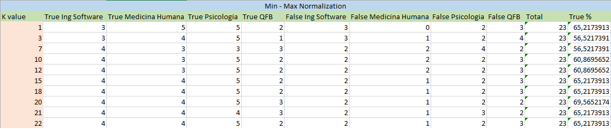

### UAZ Students

###### This dataset contains relevant data of the students who are studying the undergraduate level of different programs at the Autonomous University of Zacatecas.
###### The data were obtained through surveys that were made to the student population, later we selected those that could help us in our investigation.
###### The data set file's name is datasetUAZ.csv, in the next block we read the dataset to continue working with it.

```{r}
knitr::opts_chunk$set(echo = TRUE)
dsuaz <- read.csv("datasetUAZ.csv", stringsAsFactors = FALSE)
```


#### The Survey
###### The survey consisted of 23 questions, which became our attributes in the dataset, The survey was carried out digitally, we created the survey with the tool of Google, and through social networks we distributed it among the students.
###### After completing the survey we obtained 254 responses in total, however after analyzing the data we realized that only 142 records were useful, since we grouped the data according to the degree to which they belonged we observed that the numbers of students of The same degree that answered our survey was very different, so to have more balanced data regarding the number of students who answered the survey we decided to eliminate those answers that were below average.
###### Then we can observe each one of the questions we made and some examples of the types of answers that we obtained:
```{r strwbcd}
str(dsuaz)
```

##### Head & Tail
###### With the head and tail functions we can get a small sample of the data, those first six records with each of its attributes and their values and the last six records of the dataset.
```{r, headtail}
head(dsuaz)
tail(dsuaz)
```

##### Dataset Summary
###### Por medio de la funci??n summary obtenemos distintas estad??sticas de los datos almacenados en el dataset. Esta funci??n invoca distintos m??todos de acuerdo al tipo de objeto que est?? recibiendo como argumento, en este caso espec??fico es un dataset.
```{r, summary}
summary(dsuaz)
```
```{r, genero}
table(dsuaz$genero)
summary(dsuaz$genero)

genero <- factor(dsuaz$genero)
planesegreso <- factor(dsuaz$planes_egreso)
hrsestudio <- factor(dsuaz$hrs_estudio_dia)


plot(genero, hrsestudio, xlab = "GENDER", ylab = "STUDY HOURS")

plot(genero, planesegreso, xlab = "GENDER", ylab = "EARNING PLANS")
```

```{r, edad}
table(dsuaz$edad)
summary(dsuaz$edad)
```

```{r, municipio}
table(dsuaz$municipio)
```

```{r, hrsestudio}
table(dsuaz$hrs_estudio_dia)
summary(dsuaz$hrs_estudio_dia)
```

```{r, hrstv}
table(dsuaz$hrs_tv_dia)
summary(dsuaz$hrs_tv_dia)
```

```{r, hrsejercicio}
table(dsuaz$hrs_ejercicio_dia)
summary(dsuaz$hrs_ejercicio_dia)
```


```{r, hrsatcvsocial}
table(dsuaz$hrs_actsocial_dia)
summary(dsuaz$hrs_actsocial_dia)
```

```{r, hrsuniversidad}
table(dsuaz$hrs_universidad_dia)
summary(dsuaz$hrs_universidad_dia)
```

```{r, hrsdormir}
table(dsuaz$hrs_dormir_dia)
summary(dsuaz$hrs_dormir_dia)
```

```{r, usotransporte}
table(dsuaz$transporte_publico)
summary(dsuaz$transporte_publico)
```

```{r, comedor}
table(dsuaz$comedor)
summary(dsuaz$comedor)
```

```{r, becario}
table(dsuaz$becario)
summary(dsuaz$becario)
```

```{r, licenciatura}
table(dsuaz$licenciatura)
```

```{r, semestre}
table(dsuaz$semestre)
summary(dsuaz$semestre)
```

```{r, dificultad}
table(dsuaz$dificultad_licenciatura)
summary(dsuaz$dificultad_licenciatura)
```

```{r, pasion}
table(dsuaz$pasion_licenciatura)
summary(dsuaz$pasion_licenciatura)
```

```{r, materiasrepetidas}
table(dsuaz$materias_repetidas)
summary(dsuaz$materias_repetidas)
```

```{r, promedio}
table(dsuaz$promedio)
summary(dsuaz$promedio)
```

```{r, ofertalaboral}
table(dsuaz$oferta_laboral)
summary(dsuaz$oferta_laboral)
```

```{r, salario}
table(dsuaz$Ssalario_estimado)
```

```{r, planesegreso}
table(dsuaz$planes_egreso)
```

### Boxplots
```{r}
boxplot(dsuaz$hrs_estudio_dia, xlab="Study hours each day")
```

```{r}
boxplot(dsuaz$promedio, xlab="Qualification of each student")
```

```{r}
boxplot(dsuaz$hrs_dormir_dia, xlab="Sleep hours for each student")
```

```{r}
boxplot(dsuaz$pasion_licenciatura, xlab="Students pasion/love with his/her career")
```

```{r}
boxplot(dsuaz$oferta_laboral, xlab="difficulty to get a job with his/her career")
```

```{r}
boxplot(dsuaz$edad, xlab="Students age")
```

### Histograms. Interpretation
```{r}
hist(dsuaz$hrs_estudio_dia,
     main = "Histogram of the study hours each day",
     xlab = "Hours",
     ylab = "Students quantity",
     labels = TRUE)
```

```{r}
hist(dsuaz$promedio,
     main = "Histogram of qualification of each student",
     xlab = "Qualification",
     ylab = "Students quantity",
     labels = TRUE)
```

```{r}
hist(dsuaz$hrs_dormir_dia,
     main = "Histogram of the sleep hours for each student",
     xlab = "Hours",
     ylab = "Students quantity",
     labels = TRUE)
```

```{r}

hist(dsuaz$pasion_licenciatura,
     main = "Histogram of the students pasion/love with his/her career",
     xlab = "Pasion",
     ylab = "Students quantity",
     labels = TRUE)
```

```{r}

hist(dsuaz$oferta_laboral,
     main = "Histogram of the difficulty to get a job with his/her career",
     xlab = "difficulty",
     ylab = "Students quantity",
     labels = TRUE)
```

```{r}

hist(dsuaz$edad,
     main = "Histogram of the student age",
     xlab = "Age",
     ylab = "Students quantity",
     labels = TRUE)
```
### Parte 2- KNN- Formulas to Normalize
```{r set}

# Funcion para Normalizar por min-max
minmax <- function(x) (
  return (( x - min(x)) / (max(x) - min(x)))
  ) 
  

# Funcion para Normalizar por z-Score
zscore <- function(x) (
  return (x - mean(x) / (sd(x)))
  )
```

### Parte 2- KNN- Normalization
```{r}
dsuaz$Ssalario_estimado <- factor(dsuaz$Ssalario_estimado)


dsuaz$Ssalario_estimado <- as.numeric(dsuaz$Ssalario_estimado);

# 1- Laborar 2- Posgrada
dsuaz$planes_egreso <- factor(dsuaz$planes_egreso)

dsuaz$planes_egreso <- as.numeric(dsuaz$planes_egreso)

# 1- Hombre 2- Mujer
dsuaz$genero <- factor(dsuaz$genero)

dsuaz$genero <- as.numeric(dsuaz$genero)

dsuaz$licenciatura <- factor(dsuaz$licenciatura)

dsuaz_n <- as.data.frame(sapply(dsuaz[,c(3,5,8,13,17)], minmax))
dsuaz_zs <- as.data.frame(sapply(dsuaz[,c(3,5,8,13,17)], zscore))
```


### Compute Distances
```{r}

```

### Training and Testing set
#### Count of persons in each career
```{r}
dsuaz_train_labels <- dsuaz[1:90,21]
dsuaz_testing_labels <- dsuaz[91:113,21]
table(dsuaz_train_labels)
table(dsuaz_testing_labels)
```

#### Min Max Normalization
```{r}
dsuaz_train <- dsuaz_n[1:90,]
dsuaz_testing <- dsuaz_n[91:113,]

dim(dsuaz_train)
dim(dsuaz_testing)
```

#### Z-score Normalization
```{r}
dsuaz_train_zs <- dsuaz_zs[1:90,]
dsuaz_testing_zs <- dsuaz_zs[91:113,]

dim(dsuaz_train_zs)
dim(dsuaz_testing_zs)
```


### KNN classification outputs
#### Min Max Normalization
```{r}
library(class)
library(gmodels)
dsuaz_results <- knn(train = dsuaz_train,test = dsuaz_testing,cl = dsuaz_train_labels, k = 1)

CrossTable(x = dsuaz_testing_labels,
            y = dsuaz_results,
            prop.chisq = FALSE)
```

#### Z-score Normalization

```{r}
 library(class)
 library(gmodels)
 dsuaz_results_zs <- knn(train = dsuaz_train_zs,test = dsuaz_testing_zs,cl = dsuaz_train_labels, k = 1)
 
 CrossTable(x = dsuaz_testing_labels,
             y = dsuaz_results_zs,
             prop.chisq = FALSE)
```
 
### Determine the optimal K
#### Min Max Normalization
#### In the table, we can see that the k equal to 20 is the best because it gives us the best true porcentage over the rest.
<center>


#### Z-score Normalization
#### In the table, we can see that the k equal to 10, 12 or 18 are the best because they give us the best true porcentage over the rest.
<center>


### Frequency table and interpretation

####These are the table of the best k in the Min Max Normalization and Z-score normlization respectively
####In this scenario, the best normalization to use with the knn algorythm is the z-score, because it gives best true porcentage with 73.91%, min max in the other hand only gives 69.59%. Z-score got 2 fails in almost cases and careers, min max fail a lot with QBF students, z-score gave best results.

#### Min Max Normalization

```{r}
library(class)
library(gmodels)
dsuaz_results <- knn(train = dsuaz_train,test = dsuaz_testing,cl = dsuaz_train_labels, k = 20)

CrossTable(x = dsuaz_testing_labels,
            y = dsuaz_results,
            prop.chisq = FALSE)
```

#### Z-score Normalization

```{r}
 library(class)
 library(gmodels)
 dsuaz_results_zs <- knn(train = dsuaz_train_zs,test = dsuaz_testing_zs,cl = dsuaz_train_labels, k = 10)
 
 CrossTable(x = dsuaz_testing_labels,
             y = dsuaz_results_zs,
             prop.chisq = FALSE)
```

